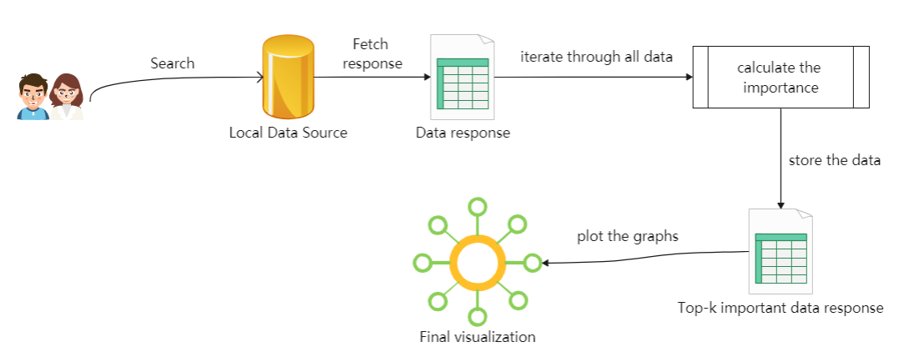
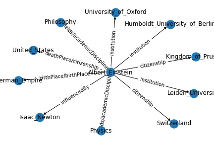
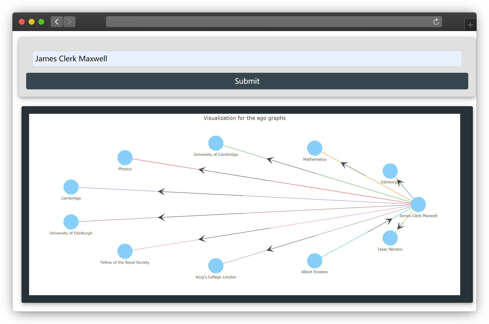

# Social Knowledge Graph Exploration 

We want to try employ SNA measures to Knowledge Graph to help novice users to explore the DBpedia more efficiently without the need to master query languages and graph structures.

**Proposal:** [Social Knowledge Graph: Employing SNA measures to Knowledge Graph](https://storage.googleapis.com/summerofcode-prod.appspot.com/gsoc/core_project/doc/6504836800970752_1618058910_Social_Knowledge_Graph-_Employing_SNA_measures_to_Knowledge_Graph_-_Zhipeng_Zhao.pdf?Expires=1629096293&GoogleAccessId=summerofcode-prod%40appspot.gserviceaccount.com&Signature=v7hwB4yvuw8nW7H7odBecE8HZ2kh7ffCOzElESDCCbiWyTlhxqre5ND7%2BtfB2jP1aAR15QXLLrJSrDinfEEH3EasVl4tF0PGrWHMyN1Im%2FxNSumMF6dsiqrpg99691PyWgSKU1YIA3X6sQFFAzmGhp82jIZmaEpTdgqrn6gntbTxOeld7tF7Xi6vthoZtAUJKjfLlST51gYag5VTRZxdsiwDkAv73sDgBJZn2A74ibHOd0WlYqYOQ1LgPA9CTjP9KM1z%2F0DxcszLE8XmTkUBcMzWtInf9g7m79E%2FZBbxugQXQxyK%2F%2BxtykFG1b4eZJPYx%2Fwl30zgCHbI3ztcAGuFvw%3D%3D)

## Introduction
When novice users use DBpedia for querying, the information they really want is always overwhelmed by numerous query results. In this project, we want to leverage the Knowledge Graph of DBpedia to develop a graph-query tool that can help the end user to obtain relevant information w.r.t his request/input/query. We can give the users a subgraph where the concept/entity that students query for is center and it is surrounded by its most important concepts (like the top-5 or top-10, in terms of the Social Network Analysis measures).

## Process


The above image shows what our developed system does after a user makes a query.

1. Users input the center entity they want to query.
2. Our system converts users input into the SPARQL.
3. Query requests to [the public endpoint](https://dbpedia.org/sparql)
4. Calculate the importance of all acquired data 
5. Get the top-10 important entities and plot the graph
6. Users can **click** on the entities on the graph to continue the query...

## Details 
This section provides a more detailed explanation of the above process.

### Data preprocessing
- Dealing with users inputs
  - Add underscores between space
  - Add backslashes before non-numeric alphabetic characters
- Cleaning the returned data of the public endpoint
  - Keep only meaningful entities and relationships and remove something like entities about time or relationships called wiki

### Ranking methods
We try to leverage 2 kinds of methods to calculate the importance of entities. One is ranked by degree and another is a new method proposed by ourselves.
- For the first method, the higher degree proves that the nodes are more scalable and more beneficial to help users expand the graph.
- As our proposed method, it consists of the following components:
  - Clustering
    - Let the similar relationships all come together
  - Normalization
    - Normalization in clusters
  - Attenuation
    - Different levels of decay based on normalized ranking
  - Ranking
    - Sort all nodes and output them

Our proposed method performs well in removing data bias and presenting as many dimensional attributes as possible.

The following two figures show the different results obtained by the two methods above when Maxwell is the central node.



```json
{
    "Einstein family":  "rdf-schema#seeAlso",
    "United States":  "citizenship", 
    "German Empire":  "birth place",
    "Mileva Mari": "spouse",
    "Fellow of the Royal Society":  "award",
    "Heinrich Friedrich Weber":  "doctoral advisor",
    "Physics":  "fields", 
    "University of Oxford":"institution",
    "Philosophy": "fields",
    "General relativity": "famous",
    "Alfred Kleiner": "doctoral advisor"
    }
```
We can see the method we propose shows more dimensions while considering scalability(degree) and diversity(relationships).

Due to the [some reasons](https://github.com/dbpedia/social-knowledge-graph#difficulty) of the second methods, the codes we release uses the degree as ranking evaluation, but you can try the **beta version** [here](/beta/cluster_with_th_1_topk.ipynb) with [Colab](https://colab.research.google.com/notebooks/intro.ipynb#recent=true).

**Attention**: It should be noted that even though we choose the seemingly simplest method of degree expansion, we have read a lot of literature and experimented with it. Several common expansion methods can be seen in this [paper](https://people.cs.aau.dk/~matteo/pdf/SIGWEB-2020-kgexp.pdf).

## Difficulty
The reason we didn't put the code on the server was that the cloud service I had purchased required a vpn connection to access the public endpoint, and I kept getting [errors](https://forum.dbpedia.org/t/chapter-deployment-help-thread/950) when trying to download the data down, which turns out to be the storage problems.

The ideal way is download the data to convert the network requests to local queries, and then store the results getting by the two methods in advance which could be  efficient and stable for users.If so, we can actually use [a more fetching way](https://github.com/plotly/dash-cytoscape/blob/master/demos/usage-elements-extra.py) of expanding.

Reasons why not apply for the new method in the final version:
1. we can't download the data and compared to "degree method", it will cost more time for calculation.
2. More importantly, the relationships in the DBpedia are not always words.It requires to build a word dictionary manually to make the word similarity calculations successful.
> e.g  influencedBy -> influence by

## Dashboard
Users can click on the nodes in graph to do the further explorations.

### Features
- `input`：You should enter the name of an entity as input,e.g `James Clerk Maxwell` or `Albert Einstein`
- `hover`: You can hover over the edges to see the specific relationships.
- `click`: You can click an entity to expand and it will return the top-10 entites around the clicked entity.

## Development Life Cycle
Tools and Frameworks used for developing this system:
1. [Flask](https://flask.palletsprojects.com/en/1.1.x/) framework (for backend operations and handling requests)
2. [Plotly](https://plotly.com/) and [D3.js](https://d3js.org/) (for visualizations)
3. [Netwokx](https://www.bing.com/search?q=networkx&qs=n&form=QBRE&sp=-1&ghc=1&pq=networkx&sc=9-8&sk=&cvid=1F225B13683B484CB7A4BCEF51D1715D)(for visualization of methodological exploration)
4. [VS code](https://networkx.org/)(for efficient development and continous integration)

## Running on your local system
```
git clone https://github.com/dbpedia/social-knowledge-graph.git
pip install -r requirements.txt
python app.py
```
